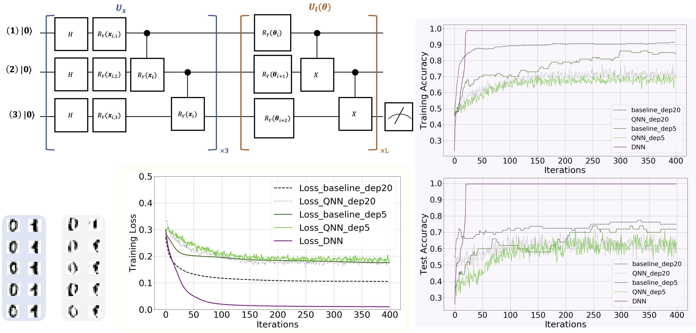

# On the learnability of quantum neural networks
This repository includes code in our paper "[On the learnability of quantum neural networks](https://arxiv.org/abs/2007.12369)".

To understand the capabilities and limitations of quantum neural networks, we theoretically explore the convergence performance of QNN under the NISQ setting. To exhibit the correctness of our analysis, we apply quantum neural networks to learn the UCI ML hand-written digits datasets and examine how the shot number and system noise effect the learning performance.  


---

## Requirements
```
python==3.7.5
numpy==1.18.1
pytorch==1.4.0
sklearn
```

## Classification results for MNIST dataset
* Baseline results achieved by QNNs with Hardware-efficient ansatz
  ```shell
  cd baseline_QNN
  python main_alg.py    # train QNN without noise
  ```

* Results achieved by QNNs with Hardware-efficient ansatz under the noisy setting
  ```shell
  cd noise_QNN
  python main_alg.py  --noise # train QNN with depolarization noise
  ```
 
* Baseline results achieved by DNNs
  ```shell
  cd DNN_baseline
  python main_alg.py  # train DNN 
  ```
---
## Experiment results
* Learning performance on MNIST dataset



The simulation results of using QNN to learn a  hand-written digit  dataset. The lower left panel  illustrates the original and reconstructed training examples, as highlighted by the blue and gray regions, respectively. The upper left panel shows the implementation of the data encoding circuit and trainable circuit used in QNN. The label "x3" and "xL" means repeating the quantum gates in blue and brown boxes with 3 and L times, respectively. The lower center panel, highlighted by the yellow region, shows the training loss under different hyper-parameters settings. In particular, the label "Loss_baseline_depL" refers to the obtained loss with circuit depth L (i.e., L=20 or L=5), p=0, and K->∞, where p, and K refer to the depolarization rate and the number of measurements to estimate expectation value used in QNN. Similarly, the label "Loss_QNN_depL" refers to the obtained loss of QNN with setting the circuit depth as L (i.e., L=5,20),  p=0.0025, and K=20; the label "Loss_DNN" refers to the obtained loss of DNN with 15 trainable parameters. The upper right and lower right panels separately exhibit the training and test accuracy of QNN with different hyper-parameters settings. 
 
---

## Citation
If you find our code useful for your research, please consider citing it:
```
@article{du2020learnability,
  title={On the learnability of quantum neural networks},
  author={Du, Yuxuan and Hsieh, Min-Hsiu and Liu, Tongliang and You, Shan and Tao, Dacheng},
  journal={arXiv preprint arXiv:2007.12369},
  year={2020}
}
```
